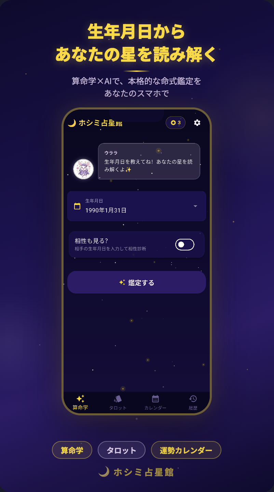
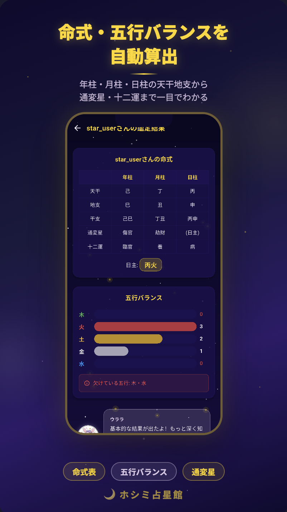
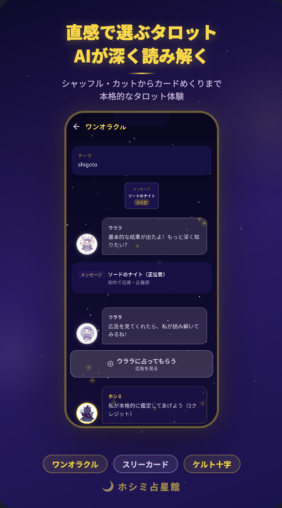
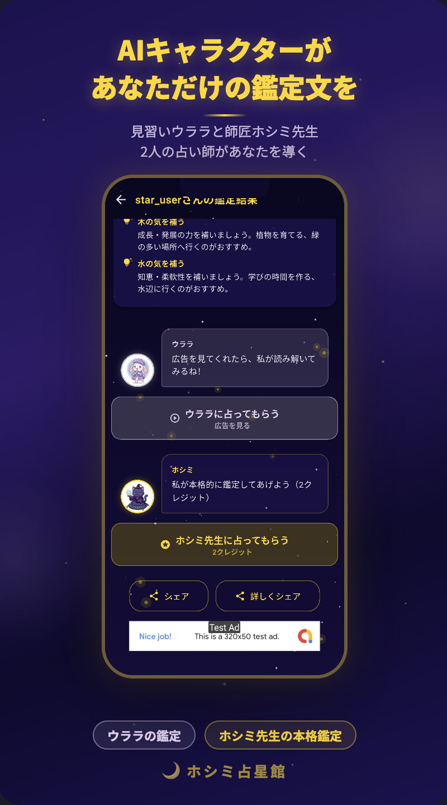
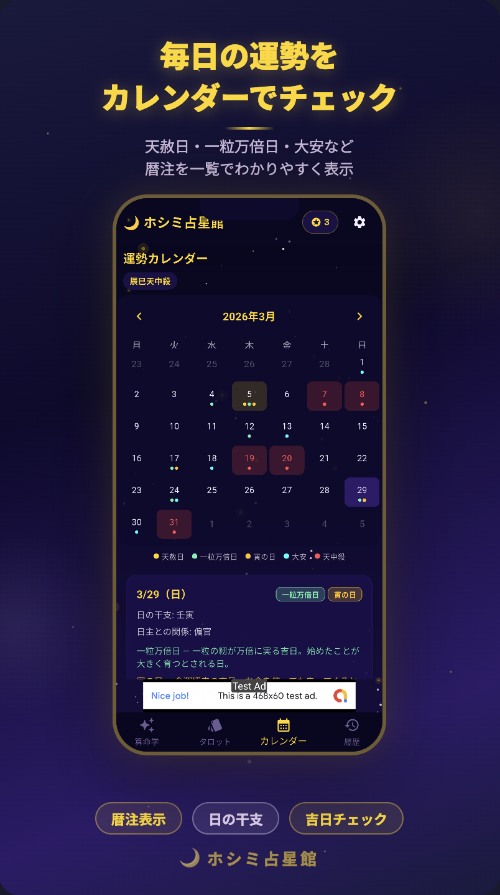

<p align="center">
  
</p>

<h1 align="center">ホシミ占星館</h1>

<p align="center">
  算命学とタロットで、あなたの運命を読み解く占いアプリ
</p>

<p align="center">
  
  
  
  
  
  
  
</p>

---

## 概要

**ホシミ占星館** は、算命学（四柱推命ベースの東洋占術）とタロットカードを組み合わせた本格占いアプリです。

生年月日から命式・五行バランス・通変星・十二運を自動算出し、2人の占い師キャラクター（見習いウララと師匠ホシミ先生）がパーソナライズされた鑑定文を生成します。

<p align="center">
  &nbsp;&nbsp;
  &nbsp;&nbsp;
  
</p>

## 主な機能

| 機能 | 説明 |
|------|------|
| **算命学鑑定** | 生年月日から命式（年柱・月柱・日柱）、五行バランス、通変星、十二運を自動算出 |
| **相性鑑定** | 2人の命式を比較し、相性を分析 |
| **タロット占い** | シャッフル・カット・カードめくりまで本格的なタロット体験 |
| **鑑定文生成** | 占い師キャラクターがパーソナライズされた鑑定文を生成 |
| **追加質問チャット** | 鑑定結果について占い師に追加で質問できる対話機能 |
| **運勢カレンダー** | 天赦日・一粒万倍日・大安など暦注を一覧表示 |
| **鑑定履歴** | 過去の鑑定結果をいつでも振り返り可能 |
| **アカウント引き継ぎ** | 機種変更時にパスワードでデータを移行 |

## スクリーンショット

<p align="center">
  &nbsp;
  &nbsp;
  &nbsp;
  &nbsp;
  
</p>

<p align="center">
  <sub>左から: ホーム ／ 算命学鑑定結果 ／ 鑑定文 ／ タロット ／ 運勢カレンダー</sub>
</p>

## アーキテクチャ

詳細は [docs/architecture.md](docs/architecture.md) を参照してください。

### システム構成

```
┌─────────────────┐     ┌─────────────────┐     ┌─────────────────┐
│  Flutter App    │────▶│  Python Server  │────▶│  Gemini API     │
│  (Android/iOS)  │     │  (Flask)        │     │  (鑑定文生成)    │
└─────────────────┘     └─────────────────┘     └─────────────────┘
        │                       │
        │ 独自認証トークン        │ SQLite (WAL)
        │                       │
        ▼                       ▼
┌─────────────────┐     ┌─────────────────┐
│  ローカルDB      │     │  SQLite DB      │
│  (sqflite)      │     │  ユーザー・履歴   │
└─────────────────┘     └─────────────────┘
                                │
                        ┌───────┴───────┐
                        │ Cloudflare    │
                        │ Tunnel        │
                        └───────────────┘
```

### 通信フロー

```
[鑑定]    Flutter ── 鑑定文生成API ──▶ Server ──▶ Gemini API ──▶ 鑑定文生成

[チャット] Flutter ── チャットAPI ──▶ Server ──▶ Gemini API ──▶ 追加質問への回答

[課金検証] Flutter ── 購入検証API ──▶ Server ──▶ Google Play / App Store API ──▶ 購入検証
```

## 技術スタック

| レイヤー | 技術 | 用途 |
|----------|------|------|
| **フロントエンド** | Flutter / Dart | クロスプラットフォームアプリ (Android / iOS) |
| **状態管理** | Riverpod | リアクティブな状態管理 |
| **ルーティング** | go_router | 宣言的ルーティング |
| **バックエンド** | Python / Flask | APIサーバー |
| **データベース** | SQLite (WAL) | サーバー側データ永続化 |
| **ローカルDB** | sqflite | クライアント側オフラインデータ |
| **鑑定文生成** | Gemini API (Vertex AI) | 占い師キャラクターによる鑑定文生成 |
| **課金** | in_app_purchase | Google Play / App Store アプリ内課金 |
| **広告** | Google AdMob | リワード広告・バナー広告 |
| **ネットワーク保護** | Cloudflare Tunnel | サーバーIPの秘匿・DDoS防御 |
| **レートリミット** | Flask-Limiter | APIエンドポイントの流量制御 |

## ドキュメント

| ドキュメント | 内容 |
|-------------|------|
| [アーキテクチャ](docs/architecture.md) | システム構成・通信フロー・認証設計 |
| [セキュリティ](docs/security.md) | 認証・ガードレール・入出力フィルタリング |
| [鑑定エンジン設計](docs/reading-engine.md) | 算命学・タロット・鑑定文生成の設計 |
| [収益化モデル](docs/monetization.md) | クレジット制・広告・アプリ内課金 |

## プロジェクト構成

```
hoshimi_seisenkan/
├── lib/                          # Flutter アプリケーション
│   ├── main.dart                 #   エントリーポイント
│   ├── engines/                  #   占い計算エンジン (算命学, タロット, カレンダー)
│   ├── models/                   #   データモデル (算命学, タロット, クレジット, キャラクター)
│   ├── screens/                  #   画面 (ホーム, 鑑定結果, タロット, カレンダー, 設定)
│   ├── services/                 #   サービス層 (API通信, 課金, 広告, ユーザー管理)
│   ├── providers/                #   Riverpod プロバイダ
│   ├── widgets/                  #   UIコンポーネント (星空背景, キャラ吹き出し, 広告)
│   ├── theme/                    #   テーマ定義
│   └── utils/                    #   ユーティリティ
├── server/
│   ├── app.py                    # Flask APIサーバー
│   ├── ai.py                     # Gemini API呼び出し
│   ├── auth.py                   # 認証ミドルウェア
│   ├── db.py                     # SQLiteデータベース操作
│   ├── guardrails.py             # 入出力フィルタリング
│   └── config.py                 # 環境設定
├── android/                      # Android プラットフォーム設定
├── ios/                          # iOS プラットフォーム設定
└── assets/                       # 画像リソース (キャラクター, タロットカード, アイコン)
```

## 開発の背景

「算命学に興味があるけど、専門書は難しくてわからない」——そんな人が、スマホで気軽に本格的な命式鑑定を体験できたら、という発想から生まれたアプリです。

東洋占術の複雑な計算（干支・通変星・五行バランス等）をアプリ内のエンジンで自動処理し、占い師キャラクターが親しみやすい語り口で鑑定文を届けます。タロットや暦注カレンダーも搭載し、毎日使える占いアプリを目指しました。

## ライセンス

このリポジトリはプロジェクトの技術紹介を目的としたショーケースです。ソースコードは非公開です。

---

<p align="center">
  <sub>Made with Flutter + Gemini API</sub>
</p>
